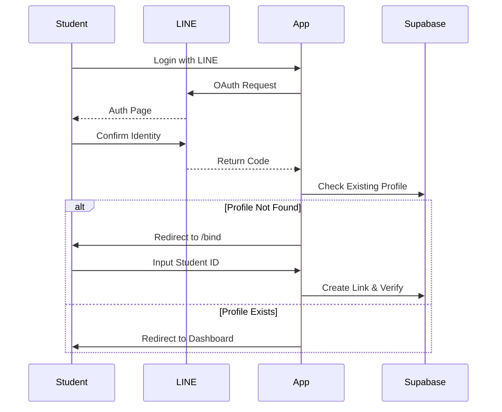
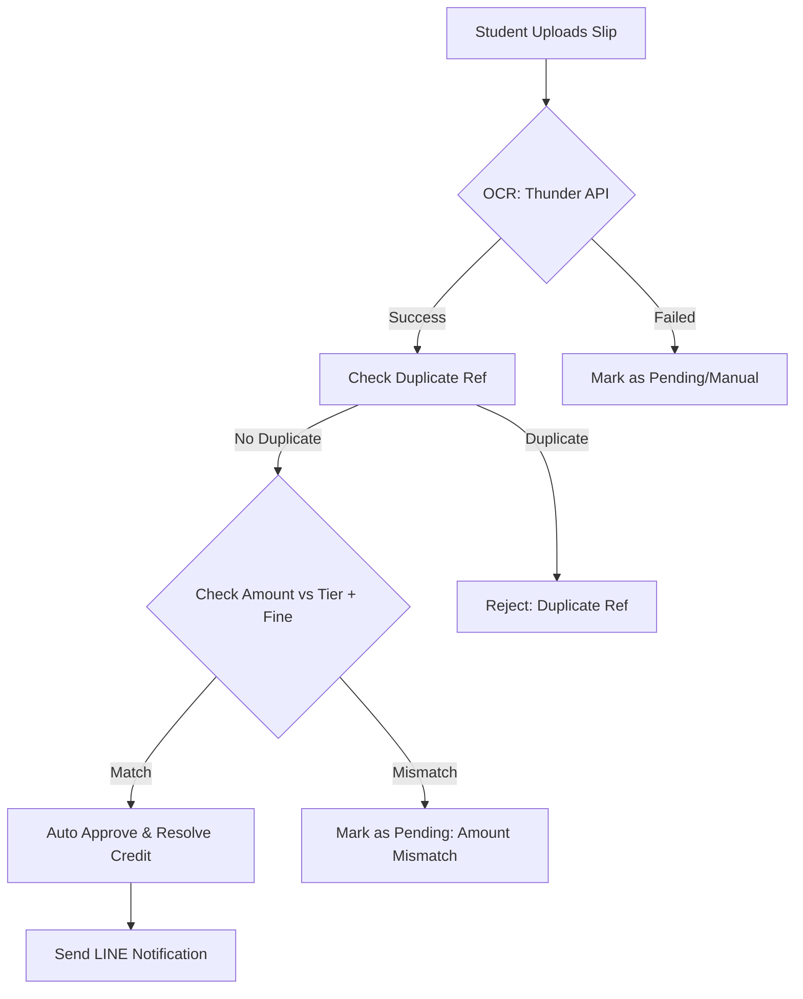

# TreasuryMS — Comprehensive Management System
### ระบบบริหารจัดการกองกลางสาขาวิทยาการคอมพิวเตอร์ (Full Documentation)

**TreasuryMS** เป็นระบบ Enterprise-grade สำหรับบริหารจัดการการเงินภายในสาขาที่ออกแบบมาเพื่อความโปร่งใส (Transparency) และประสิทธิภาพ (Efficiency) โดยใช้ AI (OCR) ในการตรวจสอบสลิปอัตโนมัติ และเชื่อมต่อกับ LINE Ecosystem อย่างเต็มรูปแบบ

---

## 🏗️ System Architecture & Tech Stack

ระบบถูกพัฒนาด้วยสถาปัตยกรรม **Modern Web Stack** เพื่อประสิทธิภาพและความปลอดภัยสูงสุด

*   **Frontend:** Next.js 15 (App Router) + TypeScript
*   **Styling:** Tailwind CSS + Shadcn UI (Custom Monochrome Theme)
*   **State Management:** Zustand (Global State)
*   **Backend as a Service:** Supabase (Auth, Postgres, Storage, Real-time)
*   **AI/OCR:** Thunder API (Slip Verification)
*   **Messaging:** LINE Messaging API + LINE Login
*   **Integrations:** axios, date-fns, jsqr, xlsx, zod

---

## 📊 System Workflows (Diagrams)

### 1. Student Onboarding & Authentication


### 2. Slip Verification & Automated Approval


---

## 🗄️ Database Schema Documentation

### Core Tables
| Table | Description | Key Columns |
|---|---|---|
| `users` | ข้อมูลนักศึกษาและแอดมิน | `id`, `student_id`, `role`, `tier`, `line_user_id` |
| `payments` | รายการส่งสลิปชำระเงิน | `id`, `user_id`, `week`, `amount`, `trans_ref`, `status` |
| `week_settings`| กำหนดการแต่ละงวด | `week`, `deadline`, `amount`, `late_fine_amount` |
| `payment_credits`| ยอดค้างชำระ (เครดิต) | `id`, `user_id`, `week`, `amount`, `status` (pending/repaid) |
| `expenses` | รายจ่ายของสาขา | `id`, `title`, `amount`, `receipt_url`, `approved_by` |
| `audit_logs` | ประวัติการกระทำในระบบ | `actor_id`, `action`, `old_value`, `new_value` |

### Row Level Security (RLS) Rules
*   **Student:** ดูข้อมูลโปรไฟล์ตนเอง, ส่งสลิปตนเอง, และดูหน้ารายรับ-รายจ่ายสาขา (Transparency) ได้เท่านั้น
*   **Treasurer/Admin:** มีสิทธิ์ในการ `INSERT`, `UPDATE` ข้อมูลในทุกตาราง (Bypass RLS ผ่าน Admin Client ในบาง API)

---

## 🔌 API Documentation (Endpoints)

| Endpoint | Method | Description |
|---|---|---|
| `/api/auth/bind` | `POST` | ผูกรหัสนักศึกษาเข้ากับ LINE Account |
| `/api/payments/upload`| `POST` | อัปโหลดสลิป + รัน OCR + บันทึกผล |
| `/api/payments/verify`| `PATCH` | แอดมินตรวจสอบและอนุมัติสลิปด้วยมือ |
| `/api/credits` | `GET/POST`| ดึงข้อมูลเครดิต หรือสร้างยอดค้างชำระใหม่ |
| `/api/students/[id]/tier`| `PATCH`| เปลี่ยนระดับ Tier ของนักศึกษา (พร้อมเช็คโควต้า) |
| `/api/admin/notify` | `POST` | ส่ง LINE Flex Message แจ้งเตือนค้างชำระ |
| `/api/reports/export` | `GET` | ดาวน์โหลดไฟล์สรุปรายงานการเงิน (Excel) |

---

## 📖 Operational Manual (คู่มือการใช้งาน)

### 👨‍🎓 สำหรับนักศึกษา (Student)
1.  **การจ่ายเงิน:** ระบบจะคำนวณยอดเงินที่ต้องจ่ายให้อัตโนมัติ (ยอดปกติ + ค่าปรับถ้าจ่ายช้า)
2.  **การอัปโหลด:** หาก OCR ตรวจพบว่าสลิปถูกต้องและยอดเงินตรง ระบบจะอนุมัติทันที (Auto-approve)
3.  **เครดิต:** หากไม่สามารถจ่ายได้ทันเวลา สามารถขอเหรัญญิกบันทึก "เครดิต" เพื่อชำระภายหลังได้ (จะไม่ถูกปรับ)

### 👨‍💼 สำหรับเหรัญญิก/แอดมิน (Admin)
1.  **การจัดการ Tier:**
    *   **Tier A:** สำหรับคนใจดี (฿60)
    *   **Tier B:** ปกติ (฿50)
    *   **Tier C:** ลดหย่อนพิเศษ (฿30) - *มีระบบโควต้าจำกัดจำนวนคน*
2.  **การแจ้งเตือน:** สามารถกดปุ่มแจ้งเตือนในหน้า Payments เพื่อยิง LINE หาคนที่ยังไม่จ่ายได้ทันที
3.  **การล้างข้อมูล (System Reset):** เมื่อจบเทอม สามารถล้างประวัติการจ่ายเงินและรีเซ็ต Tier กลับเป็น B ทั้งหมดได้ในหน้า Settings

---

## 🛠️ Troubleshooting & Ops Guide

| ปัญหาที่พบบ่อย | วิธีแก้ไข |
|---|---|
| **OCR อ่านยอดเงินไม่ตรง** | แอดมินสามารถเข้าไปที่หน้า Payments แล้วกดแก้ไขยอดเงิน หรือกดยอมรับด้วยตัวเอง (Manual Approve) |
| **สลิปซ้ำ (Duplicate Ref)** | ระบบจะบล็อกทันทีหากเลข Transaction Ref เคยถูกใช้แล้ว เพื่อป้องกันการใช้สลิปเดิมซ้ำ |
| **นักศึกษาเปลี่ยน LINE** | แอดมินต้องไปที่หน้า Students แล้วเลือก "Reset LINE Binding" เพื่อให้นักศึกษาผูกบัญชีใหม่ |
| **ยอดเงินคงเหลือไม่ตรง** | ตรวจสอบในหน้า Audit Logs เพื่อดูว่ามีการแก้ไขข้อมูลย้อนหลังโดยใคร |

### ขั้นตอนการ Reset ระบบสำหรับเทอมใหม่
1.  ไปที่หน้า **Settings > Data Management**
2.  กด **"Reset All Data"** (ระบบจะลบสลิป, ใบเสร็จ, เครดิต และรีเซ็ต Tier ของทุกคน)
3.  ตั้งค่า **Week Settings** สำหรับเทอมใหม่ (กำหนดวันที่และยอดเงิน)

---

## ⚙️ Environment Variables Setup

```env
# Supabase
NEXT_PUBLIC_SUPABASE_URL=...
NEXT_PUBLIC_SUPABASE_ANON_KEY=...
SUPABASE_SERVICE_ROLE_KEY=...

# LINE Developers
LINE_CHANNEL_ID=...
LINE_CHANNEL_SECRET=...
LINE_CHANNEL_ACCESS_TOKEN=...

# OCR Service
THUNDER_API_KEY=...

# App Config
NEXT_PUBLIC_APP_URL=http://localhost:3000
```

---

## 📂 Project Structure

```text
src/
├── app/             # หน้าเว็บและ API Routes (App Router)
│   ├── (admin)/     # ระบบหลังบ้านเหรัญญิก
│   ├── (student)/   # แดชบอร์ดและประวัตินักศึกษา
│   └── api/         # Backend Endpoints
├── components/      # UI Components (Atomic Design)
├── hooks/           # Custom React Hooks
├── lib/             # Core Logic (Supabase, LINE, OCR, Utils)
├── store/           # Global State (Zustand)
└── types/           # TypeScript Definitions
```

---

**Developed by CS Treasury Team** | ระบบนี้ถูกสร้างขึ้นเพื่อมาตรฐานความโปร่งใสทางการเงินสูงสุดของพวกเรา
